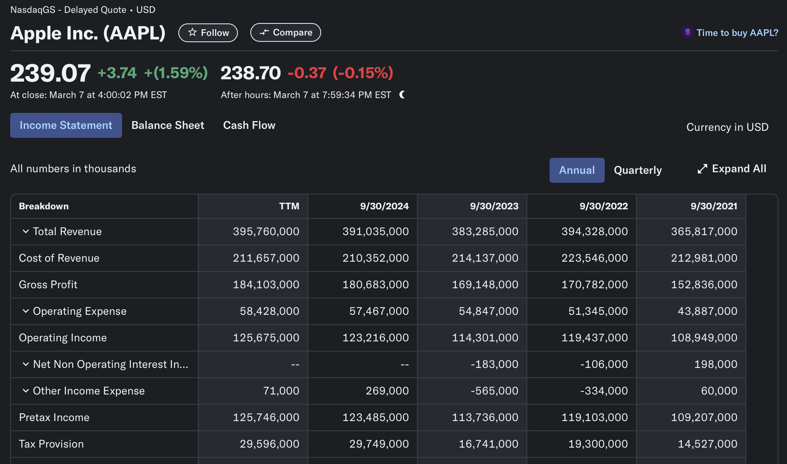
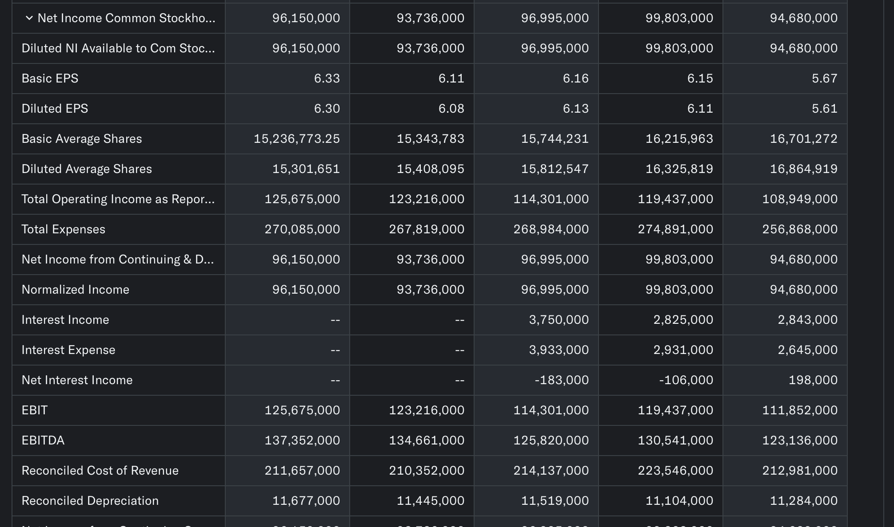
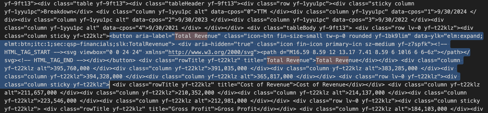
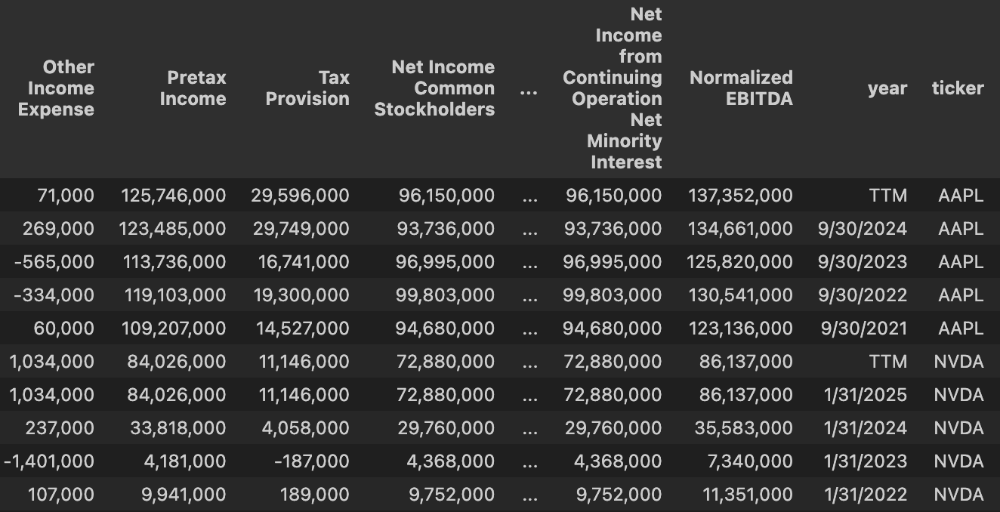

# Yahoo Finance Scrapper
*Scrapping financial data from Yahoo finance.*

## Goal

This script parses the financial data page from yahoo finance for a list of tickers and put them all in a dictionary (of dictionaries). The data we are targeting comes from the url 'https://finance.yahoo.com/quote/AAPL/financials/' (exemple from Apple's ticker) are shown in the two screenshots below:



*the data this script is scrapping*

Another function (provided) transforms the scrapped data into a Pandas dataframe for further analysis and work.

## Methodology

The code iterates through the list of tickers provided and requests the corresponding url page using the Requests method and BeautifulSoup. We use a list of web browser agents (please refer to the code file) in order to avoid detection and blocking.

```      
    # randomly choose an agent
    user_agent = random.choice(user_agents)
    headers = {'User-Agent': user_agent}

    # construct the URL using the ticker passed as argument to the function
    URL = f"https://finance.yahoo.com/quote/{ticker}/financials/"

    page = requests.get(URL, headers=headers)
    soup = BeautifulSoup(page.content, "html.parser")
    soup_str = str(soup)
```

The extracted data are shown below and the section about 'Total Revenue' row from Google Finance page is highlighted.



We then need to identify some code (html for instance) patterns that we could use with regular expression to extract the data we are interested in and put them in a more usable format. Below is the code used to extract each row of the table (getting the row name as well as the data) and put them in a dictionary for each ticker:

‘‘‘
    results = dict()
            # here we use regular expressions (regex) to target the specific bits we are interested in
            for i in re.findall("column sticky(.*?)<div class=\"row lv-0", substr):
                title = re.findall('title=\"(.*?)\"', i)[0]
                data = re.findall('<div(.*?)</div>', i)[1:]
                data_ = [re.findall('>(.*) ', d)[0] for d in data if re.findall('>(.*) ', d)[0] not in title]
                results[title] = data_
            results['year'] = year
‘‘‘

Please check the code files for me details.

## Results

The result comes in the form of a dictionary of dictionaries with the following structure:

    results = {
        ticker-1: { 'Total Revenue' : [123, ..., 789],
                    'Cost of Revenue' : [123, ..., 789],
                    ...,},
        ticker-2: { 'Total Revenue' : [456, ..., 785],
                    'Cost of Revenue' : [458, ..., 963],
                    ...,},
        ...
    }

This can easily be put into a Pandas dataframe format (function provided in the code) ready for any analytical task.



## Future work

As future work, it could be interesting to scrap more data from the page. For instance, getting what is in the 'Statistics' tab could be worthwhile and nicely complement what we already extracted for further data analytics tasks. 